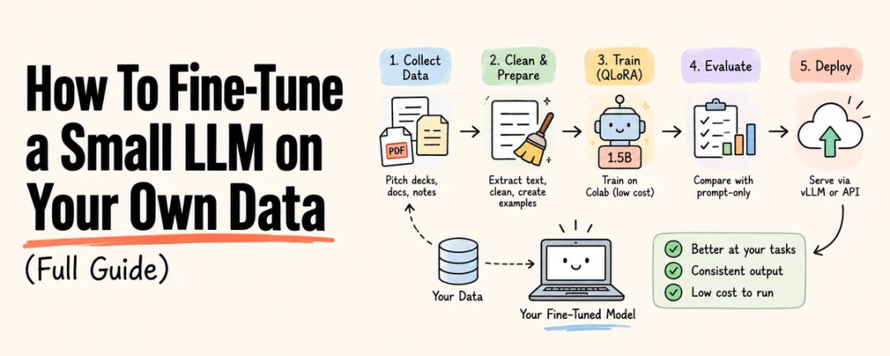
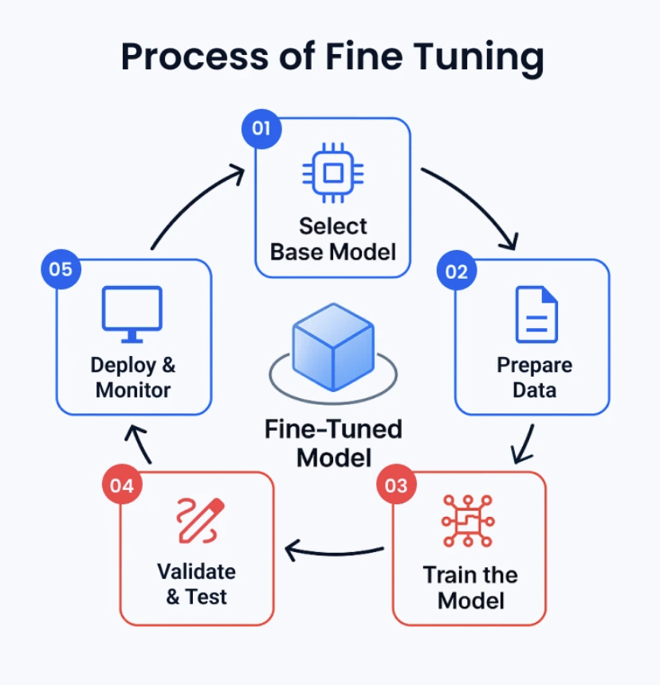

# How To Fine-Tune a Small LLM on Your Own Data

> Full guide extracted from [Rahul's X post](https://x.com/sairahul1/status/2100882424343265527).
>
> Original post: “Fine-tuning is about to become one of the most valuable AI engineering skills. Not because everyone needs a custom model. But because the people who understand how models learn from data will build things others can’t.”



## Overview

You do not need a 70B model.

You do not need $100,000 in compute.

You do not need a machine learning team.

A 1.5B parameter model fine-tuned on 200–500 good examples can outperform a frontier model prompted generically at your specific task.

This is the complete guide:

- Data collection
- Cleaning
- Dataset creation
- QLoRA training
- Google Colab
- Evaluation
- Deployment

Working code is included at every step.

Save this. Feed it to AI and fine tune your data.



## Actual goal of fine-tuning

Most people think fine-tuning makes a model smarter.

It does not.

Fine-tuning makes a model consistently better at one narrow task.

That is the whole value proposition.

Here is the example used throughout this guide: a model that accepts a startup brief like this:

```text
We help independent clinics reduce missed appointments
with automated reminders, scheduling workflows, and
patient follow-up. Raising a seed round to expand
the product and sales team.
```

And produces funding-pitch copy like this:

```text
Independent clinics lose revenue every week because
appointment reminders and rescheduling are handled manually.

Our platform gives clinics one workflow for reducing
missed appointments without requiring additional
administrative staff.

We are starting with small and mid-sized clinics,
where operational inefficiency is expensive but
existing software is often fragmented.
```

Clean. Grounded. No invented metrics. No forced slide structure.

A 1.5B model doing this reliably is more valuable than a 70B model doing it inconsistently.

That is the bet we are making.

## Fine-tuning is not your first step

Before training anything, build three baselines:

```text
Baseline 1: Strong prompt-only
Baseline 2: Prompt + retrieval (RAG)
Baseline 3: Fine-tuned model
```

Fine-tuning can improve:

- Tone
- Structure
- Consistency
- Domain vocabulary
- Instruction compliance

Fine-tuning cannot reliably give the model:

- Current market data
- Competitor intelligence
- Real-time facts

If your model needs to know current market sizes or funding trends, use retrieval—not training.

The architecture that works:

```text
startup brief
      ↓
optional retrieval (market data, evidence)
      ↓
small fine-tuned model
      ↓
plain-text output
```

Only start fine-tuning after your prompt-only baseline fails at something specific.

## Step 1 — Pick a small base model

Start between 0.5B and 3B parameters.

Good starting points:

```text
Qwen/Qwen2.5-1.5B-Instruct    ← start here
Qwen/Qwen3-0.6B
HuggingFaceTB/SmolLM2-1.7B-Instruct
```

For this guide:

```text
Qwen/Qwen2.5-1.5B-Instruct
```

Small enough for QLoRA on a T4 GPU. Large enough for useful business writing.

**Do not start with 7B or 14B.** Larger models mean:

```text
Higher GPU memory requirements
Longer training time
Higher serving cost
More operational complexity
Higher risk of overfitting a small dataset
```

Start with the smaller model. Upgrade only if it fails evaluation.

## Step 2 — Data rights before scraping anything

This is the step everyone skips—and it is the most dangerous one.

Public availability does not mean training permission.

For every data source, record this before downloading a single file:

```python
source_record = {
    "source_id": "awesome-pitch-decks",
    "source_url": "https://github.com/...",
    "owner": "...",
    "rights_status": "approved",   # not assumed
    "permission_scope": "training",
    "commercial_use_permitted": True,
    "redistribution_permitted": False,
    "rights_reviewed_at": "2026-09-17",
    "private_evidence_ref": "private://permissions/..."
}
```

What goes in your public GitHub repository:

```text
✓ Source metadata
✓ File hashes
✓ Processing code
✓ Dataset schemas
✓ Evaluation code
```

What stays private:

```text
✗ Raw PDFs
✗ OCR output
✗ Human gold transcriptions
✗ Permission emails
✗ User-submitted data
```

Get this right first. The rest is just engineering.

## Step 3 — Download data reproducibly

Never blindly crawl. Use an explicit allowlist of approved URLs.

For every file:

```python
from pathlib import Path
import hashlib, json, time, requests

APPROVED_URLS = [
    # Only URLs you have permission to process
    "https://example.com/approved-pitch-deck.pdf",
]

RAW_DIR = Path("data/raw/approved-source")
RAW_DIR.mkdir(parents=True, exist_ok=True)


def sha256_file(path: Path) -> str:
    digest = hashlib.sha256()
    with path.open("rb") as f:
        for chunk in iter(lambda: f.read(1024 * 1024), b""):
            digest.update(chunk)
    return digest.hexdigest()


manifest = []

for url in APPROVED_URLS:
    filename = url.rstrip("/").split("/")[-1] or "download.pdf"
    destination = RAW_DIR / filename

    response = requests.get(url, timeout=60,
        headers={"User-Agent": "my-project/1.0"})
    response.raise_for_status()

    # Verify it is actually a PDF
    if not response.content.startswith(b"%PDF-"):
        raise ValueError(f"Not a PDF: {url}")

    destination.write_bytes(response.content)

    manifest.append({
        "url": url,
        "filename": filename,
        "sha256": sha256_file(destination),
        "bytes": destination.stat().st_size,
        "downloaded_at": time.strftime("%Y-%m-%dT%H:%M:%SZ"),
    })

Path("data/raw/download-manifest.json").write_text(
    json.dumps(manifest, indent=2) + "\n", encoding="utf-8"
)
```

Every file gets:

- A hash
- A timestamp
- A manifest entry

Duplicates are skipped by content hash. No silent re-downloads.

## Step 4 — Extract text from PDFs and OCR

Pitch decks are hard documents:

- Large text
- Tiny footnotes
- Charts
- Tables
- Rotated text
- Numbers embedded in images
- Multiple columns

Use a cascade:

```text
1. Try native PDF text extraction
             ↓
       Enough text? → keep it
             ↓ no
2. Layout-aware OCR (Docling, PaddleOCR)
             ↓
       Good result? → keep it
             ↓ no
3. Second OCR engine or manual review
```

Record everything—including failures:

```text
page_record = {
    "document_sha256": "...",
    "page_number": 12,
    "native_characters": 0,
    "machine_draft_text": "...",
    "machine_draft_engine": "docling",
    "machine_draft_status": "drafted",
    "machine_draft_latency_ms": 842.4,
    "review_status": "machine_draft_unverified",
    "gold_text": "",   # empty until human-reviewed
}
```

**Critical rule:** do not silently drop pages where OCR returns nothing.

Empty results are your hardest cases. They show where the pipeline breaks.

Machine draft ≠ ground truth. Never conflate them.

## Step 5 — Clean the text without destroying it

Cleaning means removing extraction noise, not making it “nicer.”

Safe operations:

```python
import re
import unicodedata


def clean_text(text: str) -> str:
    text = unicodedata.normalize("NFKC", text)
    text = text.replace("\x00", "")           # null bytes
    text = text.replace("\u00a0", " ")        # non-breaking spaces
    text = re.sub(r"[ \t]+", " ", text)       # repeated spaces
    text = re.sub(r"\n{3,}", "\n\n", text)    # excessive blank lines
    return text.strip()
```

**Never auto-correct numbers.**

If OCR returns `$12.SM` instead of `$12.5M`, send it to review. Do not fix it with a language model.

A model trained on wrong numbers will produce fluent but financially incorrect output.

Track every numeric string separately:

```python
import re

NUMBER_PATTERN = re.compile(
    r"(?<!\w)(?:[$€£₹]?\s*)?\d[\d,.]*(?:\.\d+)?(?:\s*[%xXMBKmk])?"
)

numbers = NUMBER_PATTERN.findall(text)
# ["$12.5M", "80%", "38%", "2024"]
```

Numbers get evaluated independently from text quality. Always.

## Step 6 — Build the training dataset

Raw pitch-deck pages are not training data.

A deck page might contain a slogan, a chart, a legal disclaimer, or a logo wall.

Your training task is:

**Startup brief → funding-pitch copy**

Not:

**PDF page → extracted text**

You have to build the bridge.

Every training example needs:

```text
Input:  startup brief + optional context
Output: reviewed, grounded pitch copy
```

Here is the JSONL format:

```json
{
  "messages": [
    {
      "role": "system",
      "content": "Write grounded English funding-pitch copy. Return plain text only. Do not invent metrics, customers, revenue, market size, or traction."
    },
    {
      "role": "user",
      "content": "Startup brief:\nWe help independent clinics reduce missed appointments with automated reminders and patient follow-up.\n\nIndustry:\nHealthcare\n\nStage:\nSeed\n\nFundraising goal:\nExpand the product and sales team."
    },
    {
      "role": "assistant",
      "content": "Independent clinics lose revenue and staff time when appointment reminders and rescheduling are handled manually.\n\nOur platform brings these workflows into one system, helping clinics improve patient communication without adding overhead.\n\nWe are starting with small and mid-sized clinics and will use the seed round to expand the product and strengthen distribution."
    }
  ]
}
```

The output is deliberately plain text:

- No forced slide count
- No JSON
- No `title` field
- No `bullets` field

The downstream app converts output into whatever format it needs.

**Do not auto-generate training examples casually.**

Safe order:

```text
1. Collect source evidence
2. Extract text
3. Write a concise startup brief
4. Draft target copy
5. Compare target copy against source evidence
6. Human-review the target
7. Add to dataset
```

If the source does not verify a metric, do not include the metric.

Use:

> “The company reports strong early traction.”

Only if the source actually says that.

Otherwise use:

> “The company is focused on expanding early customer adoption.”

## Step 7 — Split by company, not by page

This is the data mistake that makes evaluation meaningless.

If the same company appears in both training and validation:

> Company A pitch deck, page 1 → training  
> Company A pitch deck, page 2 → validation

The model memorizes company-specific language and appears to generalize. It does not.

Split by company:

> Company A → training  
> Company B → training  
> Company C → validation  
> Company D → test

Target split:

```text
Training: 80%
Validation: 10%
Test: 10%
```

Keep a split manifest:

```python
split_manifest = {
    "split_version": "v1",
    "dataset_hash": "...",
    "train_company_ids": ["acme", "betahealth", ...],
    "validation_company_ids": ["cliniq", ...],
    "test_company_ids": ["deltacare", ...],
    "created_at": "2026-09-17T00:00:00Z",
}
```

**Never change the test set after looking at results.**

Once you evaluate against the test set, it is burned. It becomes your training signal, not your true evaluation.

## Step 8 — Set up the environment

```bash
git clone https://github.com/yourname/your-project.git
cd your-project

python3 -m venv .venv
source .venv/bin/activate

pip install --upgrade pip
pip install \
  torch \
  transformers \
  datasets \
  accelerate \
  peft \
  trl \
  bitsandbytes \
  sentencepiece \
  safetensors

pip freeze > configs/training-environment.txt
```

**Your 2-vCPU, 4GB VPS is not a training machine.**

It is perfect for:

```text
✓ API gateway
✓ Authentication and rate limiting
✓ Request queuing
✓ Redis
✓ Logging service
✓ Health checks
✓ Deployment controller
```

It is wrong for:

```text
✗ Training a 1.5B QLoRA model
✗ Running GPU inference
✗ Serving real traffic to a language model
```

Use the right machine for each job.

## Step 9 — Train with QLoRA

QLoRA loads the base model in 4-bit precision and trains a small adapter.

It uses dramatically less memory than full fine-tuning, with almost the same results.

```python
# scripts/train_qlora.py

from pathlib import Path
import torch
from datasets import load_dataset
from peft import LoraConfig
from transformers import (
    AutoModelForCausalLM, AutoTokenizer, BitsAndBytesConfig
)
from trl import SFTConfig, SFTTrainer

BASE_MODEL = "Qwen/Qwen2.5-1.5B-Instruct"
DATA_DIR = Path("data/processed")
OUTPUT_DIR = Path("artifacts/adapters/v1")

use_bf16 = torch.cuda.is_available() and torch.cuda.is_bf16_supported()
compute_dtype = torch.bfloat16 if use_bf16 else torch.float16

dataset = load_dataset("json", data_files={
    "train": str(DATA_DIR / "train.jsonl"),
    "validation": str(DATA_DIR / "validation.jsonl"),
})

tokenizer = AutoTokenizer.from_pretrained(BASE_MODEL)
if tokenizer.pad_token is None:
    tokenizer.pad_token = tokenizer.eos_token

quantization_config = BitsAndBytesConfig(
    load_in_4bit=True,
    bnb_4bit_quant_type="nf4",
    bnb_4bit_compute_dtype=compute_dtype,
    bnb_4bit_use_double_quant=True,
)

model = AutoModelForCausalLM.from_pretrained(
    BASE_MODEL,
    quantization_config=quantization_config,
    device_map="auto",
    torch_dtype=compute_dtype,
)

lora_config = LoraConfig(
    r=16,
    lora_alpha=32,
    lora_dropout=0.05,
    target_modules="all-linear",
    task_type="CAUSAL_LM",
)

training_args = SFTConfig(
    output_dir=str(OUTPUT_DIR),
    num_train_epochs=2,
    per_device_train_batch_size=2,
    per_device_eval_batch_size=2,
    gradient_accumulation_steps=8,
    learning_rate=2e-4,
    max_length=2048,
    packing=True,
    gradient_checkpointing=True,
    logging_steps=10,
    eval_strategy="steps",
    eval_steps=50,
    save_strategy="steps",
    save_steps=50,
    save_total_limit=2,
    bf16=use_bf16,
    fp16=not use_bf16,
    report_to="none",
)

trainer = SFTTrainer(
    model=model,
    args=training_args,
    train_dataset=dataset["train"],
    eval_dataset=dataset["validation"],
    processing_class=tokenizer,
    peft_config=lora_config,
)

trainer.train()
trainer.save_model(str(OUTPUT_DIR))
tokenizer.save_pretrained(str(OUTPUT_DIR))
```

Run it:

```bash
accelerate config
accelerate launch scripts/train_qlora.py
```

### Key hyperparameters explained

```text
r=16                 → LoRA adapter rank. Start here.
lora_alpha=32       → Adapter scaling (2x rank is common)
lora_dropout=0.05   → Regularization
learning_rate=2e-4  → Good LoRA starting point
num_train_epochs=2  → Start low. Overfitting is real.
gradient_accumulation_steps=8 → Simulates larger batch
packing=True         → Better GPU utilization for short examples
```

**Do not increase epochs just because training loss drops.**

The model can memorize your examples while getting worse on unseen companies.

Lower training loss does not necessarily mean better generalization.

## Step 10 — Training on Google Colab

Colab is great for first experiments: free GPU and no server to maintain.

Tradeoffs:

```text
✓ Free T4 GPU for experiments
✓ No infrastructure maintenance
✓ Great for notebooks
✗ Sessions can disconnect at any time
✗ GPU availability varies by time of day
✗ Storage resets between sessions
✗ Not a production training service
```

Start a GPU notebook and check your runtime:

```python
!nvidia-smi
```

Mount Drive to save checkpoints:

```python
from google.colab import drive
drive.mount("/content/drive")
```

Install dependencies:

```python
%pip install -U torch transformers datasets accelerate \
    peft trl bitsandbytes sentencepiece safetensors
```

Set your paths to Drive:

```python
from pathlib import Path

DATA_DIR = Path("/content/drive/MyDrive/my-project/processed")
OUTPUT_DIR = Path("/content/drive/MyDrive/my-project/adapters/v1")
OUTPUT_DIR.mkdir(parents=True, exist_ok=True)
```

**Save to Drive every 50 steps, not just at the end.**

If Colab disconnects at 95%, you want to resume rather than restart.

```python
# Resume from checkpoint if session died
trainer.train(resume_from_checkpoint=True)
```

Record your environment before every run:

```python
import torch, transformers, trl, peft, platform

print("Python:", platform.python_version())
print("Torch:", torch.__version__)
print("Transformers:", transformers.__version__)
print("TRL:", trl.__version__)
print("PEFT:", peft.__version__)
print("GPU:", torch.cuda.get_device_name(0)
      if torch.cuda.is_available() else "none")
```

Reproducibility requires knowing exactly what version ran.

## Step 11 — GPU provider strategy

Use different infrastructure for different stages.

### Google Colab

Use for:

- First experiments
- Debugging
- Small QLoRA jobs

Avoid for:

- Production
- Long runs
- Reliable scheduling

### Spot GPU providers

Examples:

- RunPod
- Vast.ai
- Modal
- Lambda
- Paperspace

Use for:

- Longer training jobs
- Per-second billing
- Reproducible Docker environments

Avoid for:

- Production serving
- Stable latency requirements

Check live pricing before every run. GPU rates change frequently.

### Dedicated GPU hosting

Use for:

- Public serving
- Stable latency
- Production deployment

Avoid for:

- Experimentation, because you pay while idle

### Estimated training cost

```text
GPU rate: $0.40/hour
Active time: 3 hours
Retries: 1 hour
Storage: $0.10

Total: ($0.40 × 4) + $0.10 = $1.70
```

The expensive part is not the first run. It is repeated experimentation:

```text
Changing prompts
Rebuilding datasets after bugs
Testing multiple ranks (r=8, r=16, r=32)
Trying different base models
Running evaluation
Serving GPU continuously for testing
```

Budget for 5–10× your first estimate.

## Step 12 — Evaluate against a prompt-only baseline

Do not compare your fine-tuned model against training loss.

Compare it against the model you were using before.

Fixed evaluation metrics:

```text
Plain-text compliance (no JSON, no slide structure)
Output usefulness (human rating 1-10)
Unsupported claim rate
Numeric preservation accuracy
Repetition rate
Readability
Latency
Token usage and cost per request
```

Numeric consistency check:

```python
import re

NUMBER_PATTERN = re.compile(
    r"(?<!\w)(?:[$€£₹]?\s*)?\d[\d,.]*(?:\.\d+)?(?:\s*[%xXMBKmk])?"
)


def numeric_strings(text: str) -> set[str]:
    return {n.replace(" ", "") for n in NUMBER_PATTERN.findall(text)}


def unsupported_numbers(source: str, generated: str) -> set[str]:
    """Numbers in output that do not appear in source"""
    return numeric_strings(generated) - numeric_strings(source)
```

A generated number not in the source evidence is a hallucination.

Catch it before your users do.

### Example scorecard

```text
Prompt-only baseline:
  Useful copy:        7.1/10
  Unsupported claims: 8%
  Numeric errors:     3%
  Avg latency:        2.4 seconds

Fine-tuned model:
  Useful copy:        8.0/10
  Unsupported claims: 2%
  Numeric errors:     1%
  Avg latency:        1.5 seconds
```

Only claim improvement if the test set was isolated before you started evaluating.

If you peeked at the test set, those results are meaningless.

## Step 13 — Serve the adapter

Two options depending on your traffic.

### Option A: vLLM — high throughput

```bash
vllm serve Qwen/Qwen2.5-1.5B-Instruct \
  --enable-lora \
  --lora-modules mymodel=./artifacts/adapters/v1 \
  --max-model-len 2048
```

Check the current vLLM LoRA documentation before deploying. Options change between versions.

### Option B: FastAPI + Transformers — low traffic

```python
from fastapi import FastAPI
from fastapi.responses import PlainTextResponse
from pydantic import BaseModel

app = FastAPI()


class StartupBrief(BaseModel):
    brief: str
    industry: str | None = None
    stage: str | None = None
    traction: str | None = None
    fundraising_goal: str | None = None


def render_prompt(request: StartupBrief) -> str:
    optional = []
    for label, value in [
        ("Industry", request.industry),
        ("Stage", request.stage),
        ("Traction", request.traction),
        ("Fundraising goal", request.fundraising_goal),
    ]:
        if value:
            optional.append(f"{label}:\n{value}")

    context = "\n\n".join(optional)

    return f"""Write grounded English funding-pitch copy.
Return plain text only. Do not return JSON.
Do not invent statistics, customers, revenue, or market size.

Startup brief:
{request.brief}

{context}""".strip()


@app.post("/generate", response_class=PlainTextResponse)
def generate(request: StartupBrief) -> str:
    prompt = render_prompt(request)
    # Load model and call here
    return "Generated pitch copy goes here."
```

**Never expose a raw model server to the internet.**

Production setup:

```text
Client → HTTPS + auth → VPS rate limiter → request queue → GPU model server → plain-text response
```

The VPS handles:

- TLS
- Authentication
- Rate limits
- Queueing

The GPU handles inference.

## Step 14 — Monitor quality after deployment

Track these metrics from day one:

```text
Request latency
Queue time
GPU memory and utilization
Error rate
Empty outputs
Token counts per request
User retry rate
Unsupported-claim reports
Model version + adapter version
```

**Do not auto-collect user data for retraining.**

Use an explicit opt-in:

```text
This request may be used to improve the model.
[ ] Yes, I consent
[ ] No
```

Even with consent, strip before storing:

```text
✗ Personal phone numbers
✗ Email addresses
✗ Customer names
✗ Private revenue figures
✗ Confidential fundraising terms
✗ Investor contact details
```

Keep production training data separate from evaluation data. Always.

### When to retrain

Not every user submission triggers a retrain.

Retrain when you have:

```text
✓ Meaningful number of reviewed examples (not raw submissions)
✓ A clear documented failure pattern
✓ A stable evaluation set
✓ A documented dataset version
✓ A rollback plan
```

A sensible cadence:

```text
v0: prompt-only baseline
v1: 200 reviewed examples
v2: 1,000 reviewed examples
v3: larger dataset + retrieval
```

Every version records:

```python
version_record = {
    "version": "v2",
    "base_model": "Qwen/Qwen2.5-1.5B-Instruct",
    "base_model_revision": "...",
    "dataset_hash": "...",
    "num_train_examples": 1000,
    "gpu_type": "A10G",
    "total_gpu_hours": 4.2,
    "eval_useful_copy": 8.3,
    "eval_unsupported_claims": 0.018,
    "eval_numeric_errors": 0.009,
    "deployment_date": "2026-09-20",
    "rollback_artifact": "artifacts/adapters/v1",
    "known_failure_modes": ["long briefs > 500 tokens"],
}
```

Never deploy without a documented rollback path.

## Sequence that actually works

This is the recommended sequence for this exact project:

```text
1. Keep downloaded PDFs and OCR drafts private

2. Finish a 50-page manual review set
   (born-digital, scanned, chart-heavy, table-heavy,
    pages with numbers, pages with no text)

3. Build 200–500 reviewed brief-to-copy examples

4. Create a prompt-only baseline
   (evaluate before touching training)

5. Split by company—not by page

6. Run a QLoRA experiment on a Colab T4 or
   low-cost temporary GPU

7. Save checkpoints to Drive every 50 steps

8. Evaluate against unseen companies

9. Compare: prompt-only vs retrieval vs fine-tuned

10. Add more examples only where the model fails

11. Deploy the adapter behind a GPU inference server

12. Use a VPS as a secure gateway

13. Load-test before claiming support for N requests/second

14. Monitor factuality and unsupported claims

15. Retrain only from reviewed, permission-cleared, opt-in data
```

## Highest-leverage improvement

**The highest-leverage improvement is almost never the learning rate.**

It is the examples.

```text
Clear startup brief
+
Verified source evidence
+
Human-reviewed target copy
+
Company-level data split

= Reliable specialist model
```

That is what turns 1.5B parameters into something genuinely useful.

## Project structure

```text
your-project/
├── data/
│   ├── raw/           # private, gitignored
│   ├── processed/     # private or gitignored
│   └── splits/        # manifests only — safe to commit
├── scripts/
│   ├── download_sources.py
│   ├── clean_ocr.py
│   ├── build_examples.py
│   ├── train_qlora.py
│   └── evaluate.py
├── configs/
│   ├── data.toml
│   └── training.toml
├── notebooks/
│   └── train_colab.ipynb
├── artifacts/
│   └── adapters/      # private model outputs
├── tests/
└── docs/
```

Raw data private. Processing code public. Evaluation code public.

Your training pipeline is reproducible even if the raw data stays private.

## References

- [Hugging Face TRL `SFTTrainer`](https://huggingface.co/docs/trl/en/sft_trainer)
- [PEFT quantization guide](https://huggingface.co/docs/peft/en/developer_guides/quantization)
- [bitsandbytes integration](https://huggingface.co/docs/bitsandbytes)
- [Google Colab FAQ](https://research.google.com/colaboratory/faq.html)
- [Qwen2.5-1.5B-Instruct model card](https://huggingface.co/Qwen/Qwen2.5-1.5B-Instruct)
- [vLLM LoRA serving](https://docs.vllm.ai/en/latest/features/lora.html)
- [RunPod pricing](https://runpod.io/pricing)
- [Modal pricing](https://modal.com/pricing)

## Original closing text

> If this was useful:
>
> → Repost to share it with every developer building with LLMs
>
> → Follow [@sairahul1](https://x.com/sairahul1) for more end-to-end AI engineering guides
>
> → Bookmark this—the code runs right now
>
> I write about AI, building products, and systems that work while you sleep.

## Source notes

- Author: Rahul (`@sairahul1`)
- Source post: [https://x.com/sairahul1/status/2100882424343265527](https://x.com/sairahul1/status/2100882424343265527)
- Shortened link included in the post: `https://t.co/oIfvJsZgea`
- The two images above were supplied separately and embedded using their local relative paths.
- The article text and code are transcribed from the supplied X page capture; check the current documentation for libraries and serving tools before running the examples.
